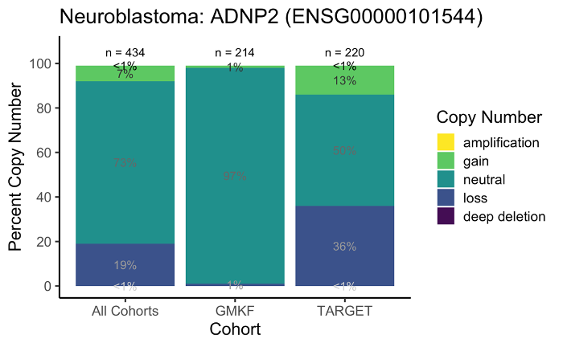
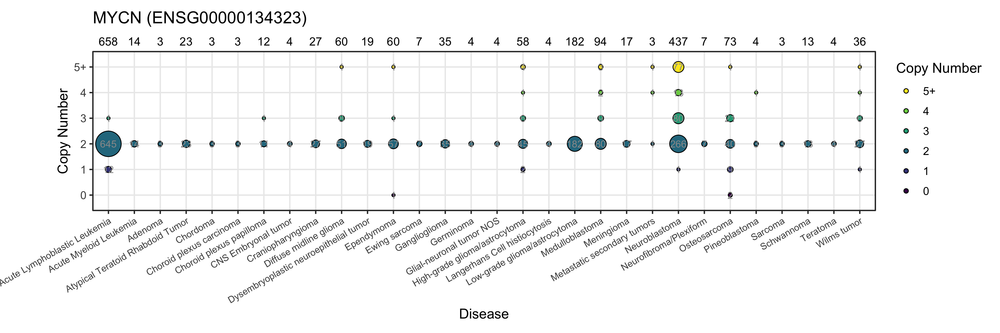
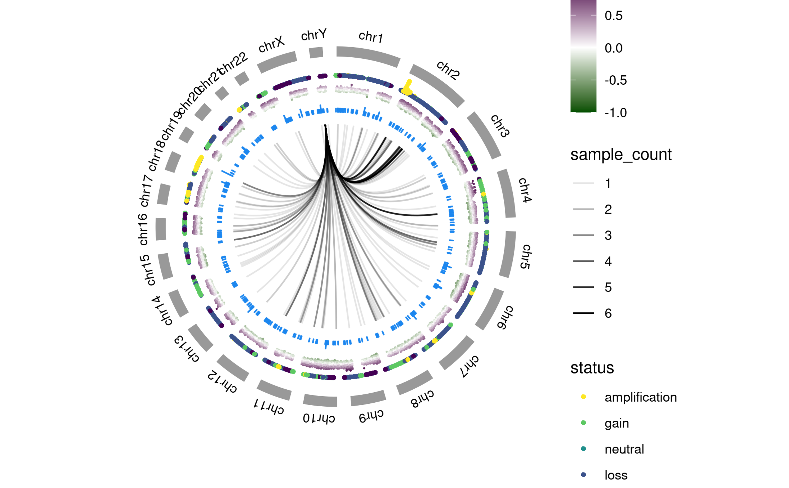

## Pilot code for copy number variant (CNV) plots
*Author:* Kelsey Keith @kelseykeith

### Purpose

This section documents and has executable code for the proposed copy number variant (CNV) plots for the OpenPedCan/MTP API. 
This code cannot be used with the API as is and is included for archival purposes only; if you would like to start working on API development, please see the [main repository README](https://github.com/PediatricOpenTargets/OpenPedCan-unfinished-development) 
**WARNING:** This code is not maintained and there may be breaking changes at any time. 
Also, funding has ended for this portion of the MTP project so data may no longer be available in the same way. 
For the most up-to-date instructions on how to access code and data, please see the main [OpenPedCan-analysis repository](https://github.com/PediatricOpenTargets/OpenPedCan-analysis).

### Pilot Plots

The Open Targets framework adopted by the Molecular Targets Project (MTP) allows the user to view data from three perspectives: disease, gene, and evidence. 
The disease view shows all data relating to the given disease, including all genes. 
The gene view shows all data relating to the given gene, so showing information for that gene in all diseases. 
The evidence page view is the most specific showing data only for a single gene in a single disease.
For the CNVs, a different plot was developed for each of the three views

#### Evidence Page View

For the evidence page view, we settled on a stacked bar plot, showing the percentages of samples at a given copy number in that gene in that disease per cohort. 
The color gives the copy number status where deep deletion is a copy number of 0, loss is a copy number less than ploidy, neutral is a copy number equal to ploidy, gain is a copy number between ploidy and 2 times ploidy and amplification is a copy number greater than 2 times ploidy. As these are cancer samples, some have ploidies other than two so the categorical labels are in reference to the ploidy of each sample. 
The total sample size for each cohort is given at the top of the stacked bar.

Development for the evidence page view had started to incorporate it into the API, so there is additional code for this view. 
For the CNV evidence view database code, please see the development fork at [kelsey/OpenPedCan-api](https://github.com/kelseykeith/OpenPedCan-api/tree/cnv-db) and for the in-process plot code refactoring, please see the [cnv-evidence-plot folder](../cnv-evidence-plot) in this repository.

#### Gene Page View

For the gene page view, we settled on a bubble plot with diseases on the x-axis, categorical copy number on the y-axis (0, 1, 2, 3, 4, 5+), with the bubbles proportional to the number of samples for the particular disease. 
Since it was useful to see both the absolute count of samples and the proportion of samples in the disease at a given copy number, the plan would have been to have two views, one for absolute count and one for percentage. 
You can see the percentage version [here](plots/final_pilot_plots/gene_page_view_bubble_plot_percents_MYCN.png)

#### Disease Page View

For the disease page view, we decided on a circos plot, which is a circular plot showing multiple levels of information. 
In the example above, all the data is in Neuroblastoma.
This one has the human genome as the outermost circle.
Next is a scatter plot with the genomic coordinates on the x-axis and copy number on the yaxis colored by the categorical copy number description (see evidence page section for a description of the categories).
The third layer in gives the correlation between copy number and expression with genomic coordinates on the x-axis and correlation on the y-axis, colored by the magnitude and direction of the correlation.
More green is a correlation closer to -1, more purple is a correlation closer to one, and white values are close to a correlation of 0.
The next layer labels whether or not that position is a known cancer gene on the Pediatric Molecular Targets List (PMTL).
Finally, the innermost layer connects gene fusion partners together. 
This does not represent all fusions present in the data, but only gives fusions for the specific disease that overlap with a CNV for at least one of the gene partners as well as having one of the gene partners on the PMTL list.
**WARNING:** There is currently an error in the circos plot code, where the innermost ring showing the fusion connections does not line up with the human genome backbone. 
The majority of the connections should line up with chr1, not chrY as it appears in the image.
As this plot is no longer under active development, the code will not be corrected.

### Usage

The code for the pilot plots

#### Evidence and Gene Views

**NOTE:** Before running code, please check the R script to make sure that you have all necessary packages installed.

To exeute the example code: `Rscript --vanilla OT_Methylation_plot.R`

Input:

- gencode annotations: `../../../OpenPedCan-analysis/data/gencode.v39.primary_assembly.annotation.gtf.gz`
- example methylation summary table: `input/example-isoform-methyl-beta-values-summary.tsv.gz`

Output:

#### Disease View