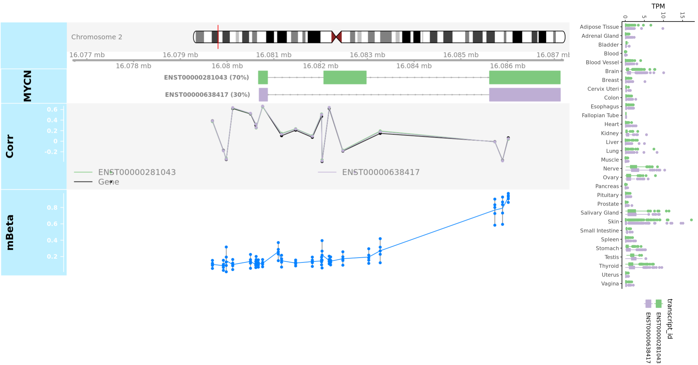

## Pilot code for methylation plots
*Author:* Alvin Farrel @afarrel

<!-- START doctoc generated TOC please keep comment here to allow auto update -->
<!-- DON'T EDIT THIS SECTION, INSTEAD RE-RUN doctoc TO UPDATE -->
**Table of Contents**  *generated with [DocToc](https://github.com/thlorenz/doctoc)*

- [Purpose](#purpose)
- [Pilot Plot](#pilot-plot)
- [Usage](#usage)

<!-- END doctoc generated TOC please keep comment here to allow auto update -->

### Purpose

This section documents and has executable code for the proposed methylation plots for the OpenPedCan/MTP API. 
This code cannot be used with the API as is and is included for archival purposes only; if you would like to start working on API development, please see the [main repository README](https://github.com/PediatricOpenTargets/OpenPedCan-unfinished-development)
**WARNING:** This code is not maintained and there may be breaking changes at any time. 
Also, funding has ended for this portion of the MTP project so data may no longer be available in the same way. 
For the most up-to-date instructions on how to access code and data, please see the main [OpenPedCan-analysis repository](https://github.com/PediatricOpenTargets/OpenPedCan-analysis).

### Pilot Plot

For the methylation plots, we proposed a multilayered plot bringing together methylation and gene expression information. 
At the top is a pictoral representation of the chromosome the gene for the plot is on with a red lining marking the location of the gene on the chromosome. 
The next layer down shows representations of all transcripts for the plot gene; MYCN only has two but there can be many different transcripts for a single gene. 
At time of project end, all methylation data in OPC was from different methylation arrays (Illumina 27K, 450K, EPIC/850K and Roche Nimblegen HELP) and these arrays all measure methylation using probes at predetermined locations in the genome and report methylation as a beta value between 0 and 1 where 0 is completely unmethylated and 1 is completely methylated. 
The next layer shows the correlation of those beta values at each probe with the transcript-specific expression of that gene. 
The last layer in the horizontal direction is the distribution of the beta values at each probe over the gene body. 
Last, on the right are boxplots showing the normal transcript-specific expression of the gene in all tissues from  GTEx.

Next steps for developing these plots for the API would be to refactor the code to handle additional variables and to prep for incorporation into the API. 
It needs to be worked out how to handle different cohorts, handle different cancer types, and how we want to handle the summary table that would be available for download with the plot, although consensus was converging on summary by gene feaure (like promoter, exon, intron, maybe TSS/TES as well).

### Usage

**NOTE:** Before running code, please check the R script to make sure that you have all necessary packages installed.

**`cnv_pilot_plot_code.Rmd`** This script reads in the data from the `OpenPedCan-analysis` submodule and the input data directory, combines/formats it appropriately, and then plots example plots for the methylation. The methylation data table is included in the `input/` folder because the summary table is above GitHub's storage limits and not included with the `OpenPedCan-analysis` submodule.

Usage:

To exeute the example code: `Rscript --vanilla OT_Methylation_plot.R`

Input:

- gencode annotations: `../../../OpenPedCan-analysis/data/gencode.v39.primary_assembly.annotation.gtf.gz`
- example methylation summary table: `input/example-isoform-methyl-beta-values-summary.tsv.gz`

Output:

- `plots/example_methylation_plot.R`

  